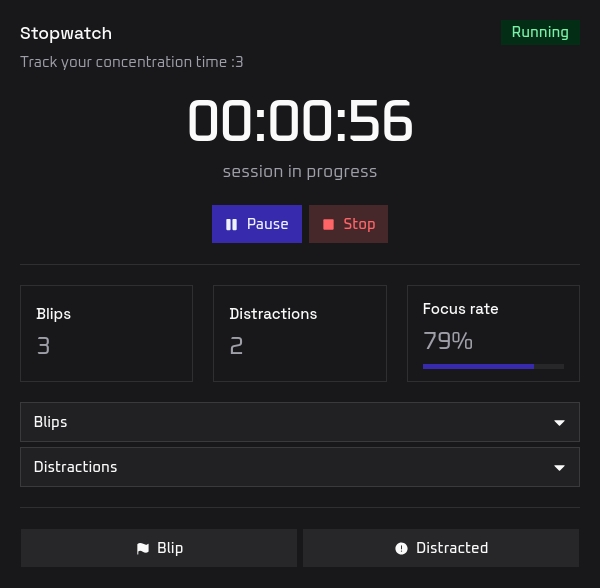
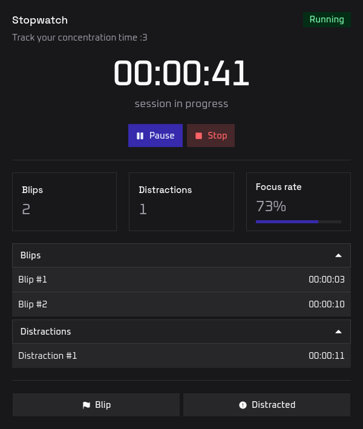
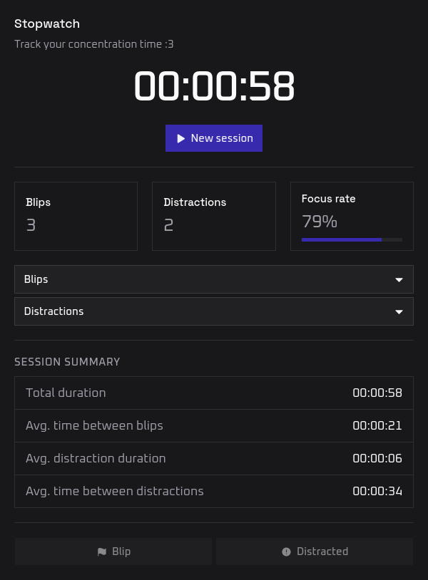

# Concentration Tracker

Concentration tracker is a stopwatch on steroids for tracking focus sessions: How often you blip out of focus, how long you stay distracted, and your overall focus rate. With short summary and stats displayed at the end of each session.

Built using TypeScript with Preact framework, TailwindCSS for inline styling, and shadcn/ui for ready-to-use components :3

> [!NOTE]  
> This was built primarily for my own use in a short time, so don't expect high quality code.  
> It was also my first time using shadcn/ui, so some things might not fit visually together.

You can access it at: https://timer.unaimeds.dev

## Screenshots



<details>
<summary>More screenshots</summary>





</details>

## Features

- Start / pause / stop a focus session (stopwatch)
- Blip: mark a brief moment where your attention slipped
- Distracted: track a full distraction period with a start and end time
- Live focus rate (calculated from total session duration and total duration you've been distracted)
- Collapsible lists of all blip timestamps and distraction durations
- Session summary after stopping: total duration, average time between blips, average distraction duration, average time between distractions

## Running locally

```bash
pnpm install
pnpm dev
```

Then open [http://localhost:5173](http://localhost:5173).

## Building

```bash
pnpm build
```

Website is then built to `dist/` directory.
Inside should be `index.html` file which you can open in your favorite browser.

## License

This project is licensed under MIT license. You can find more information in the [LICENSE](LICENSE) file.
